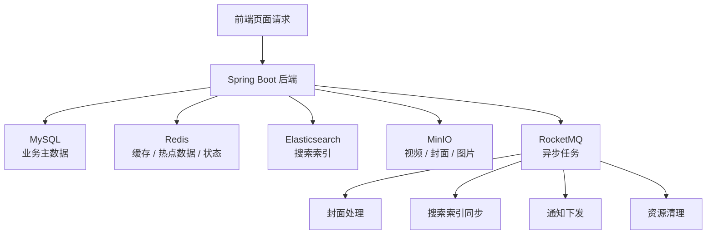
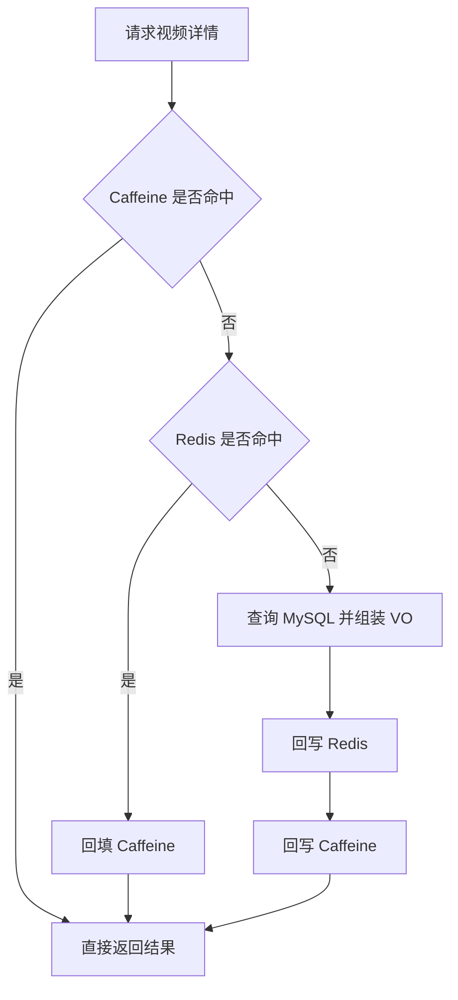
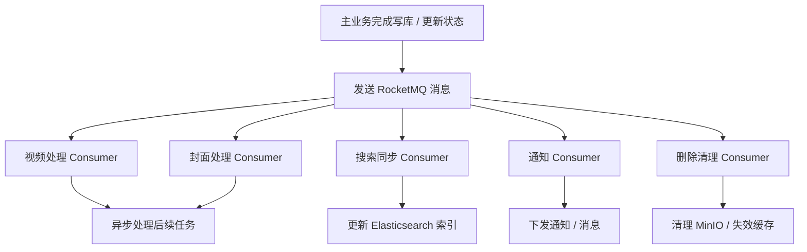
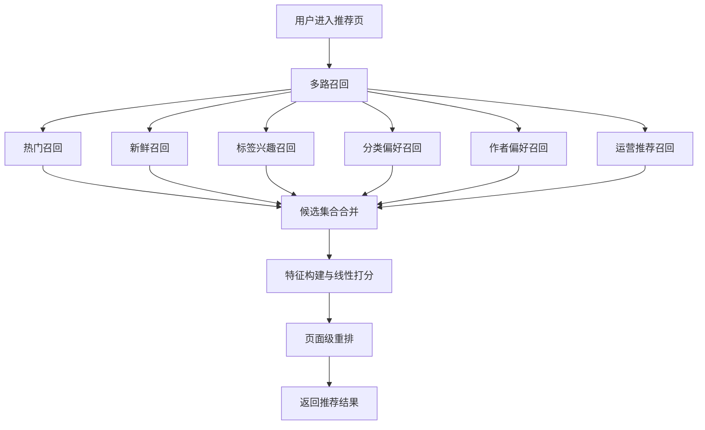
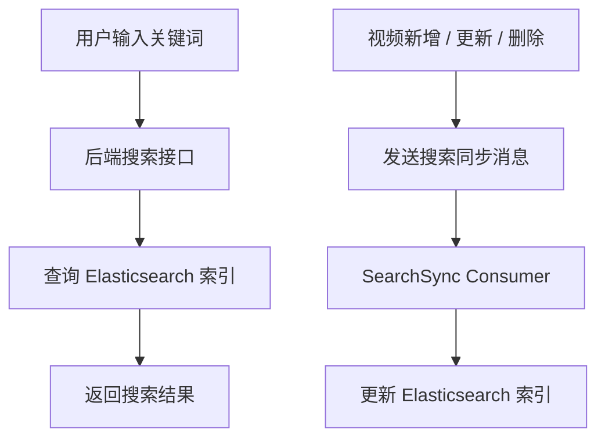

# Obsidian Interview Notes Implementation Plan

> **For agentic workers:** REQUIRED SUB-SKILL: Use superpowers:subagent-driven-development (recommended) or superpowers:executing-plans to implement this plan task-by-task. Steps use checkbox (`- [ ]`) syntax for tracking.

**Goal:** Overwrite `D:/app包/Obsidian/Obsidian Vault/项目/Video-Streaming-Platform.md` with a single-file, interview-oriented project note that uses Markdown + Mermaid to explain the system and its four core highlights.

**Architecture:** Write the external Obsidian note directly as one self-contained Markdown document. Organize it into project overview, system-wide flow, four highlight sections, and interview scripts; use only stable Mermaid `flowchart` syntax and verify the final file by re-reading it for heading coverage and Mermaid fence integrity.

**Tech Stack:** Markdown, Mermaid, Obsidian

---

## File Map

- **Modify:** `D:/app包/Obsidian/Obsidian Vault/项目/Video-Streaming-Platform.md` — final Obsidian note shown to the user.
- **Reference:** `README.md` — project overview and responsibilities baseline.
- **Reference:** `backend/src/main/resources/SYSTEM_ARCHITECTURE.md` — system-wide architecture and upload/list flows.
- **Reference:** `backend/src/main/resources/CACHE_STRATEGY.md` — cache strategy and invalidation rationale.
- **Reference:** `backend/src/main/resources/RECOMMENDATION_ARCHITECTURE.md` — recommendation pipeline and terminology.

### Task 1: Replace the file with the project overview and system-wide flow

**Files:**
- Modify: `D:/app包/Obsidian/Obsidian Vault/项目/Video-Streaming-Platform.md`
- Reference: `README.md`
- Reference: `backend/src/main/resources/SYSTEM_ARCHITECTURE.md`

- [ ] **Step 1: Overwrite the file with the title, project summary, tech stack, responsibilities, and system overview sections**

Use the exact Markdown below as the starting content of the file:

```md
# Video Streaming Platform 视频流平台

## 1. 项目简介

这是一个面向视频内容场景的全栈项目，整体参考 B 站产品形态，核心围绕视频投稿、播放、互动、搜索、推荐、通知等场景展开。项目采用前后端分离架构，后端以 Spring Boot 为核心，结合 MySQL、Redis、Elasticsearch、RocketMQ、MinIO 等组件完成数据存储、缓存优化、异步解耦和搜索推荐能力建设。

## 2. 技术栈

- 后端：Spring Boot、MyBatis-Plus、MySQL、Redis、RocketMQ、MinIO、WebSocket、Elasticsearch
- 前端：Vue 3、Vite、Pinia、Axios、Vue Router
- 设计关键词：前后端分离、两级缓存、异步解耦、多路召回、搜索索引

## 3. 我的职责

我主要负责后端核心功能开发，重点参与了视频相关主链路、搜索、推荐、缓存和异步解耦等模块设计与实现。项目里我比较关注两类问题：一类是高频读场景下的性能优化，另一类是复杂业务链路下的模块解耦和可维护性提升。

## 4. 项目核心链路总览



整个系统的主干可以理解为：前端发起业务请求后，由 Spring Boot 承接业务逻辑；MySQL 存储核心业务数据，Redis 负责缓存和热点状态，Elasticsearch 负责搜索能力，MinIO 负责对象存储，而 RocketMQ 主要承担一些不适合放在主请求链路里同步完成的任务。这样既保证了主流程可用，也为后续性能优化和功能扩展留出了空间。
```

- [ ] **Step 2: Read back the top of the file and verify the overview structure is present**

Read: `D:/app包/Obsidian/Obsidian Vault/项目/Video-Streaming-Platform.md` (top section)

Expected verification:
- The file starts with `# Video Streaming Platform 视频流平台`
- Sections `## 1` through `## 4` are present
- There is exactly one Mermaid block in the overview section
- The overview text mentions Spring Boot, MySQL, Redis, Elasticsearch, RocketMQ, and MinIO

### Task 2: Write the four core highlight sections with Mermaid diagrams and talking points

**Files:**
- Modify: `D:/app包/Obsidian/Obsidian Vault/项目/Video-Streaming-Platform.md`
- Reference: `backend/src/main/resources/CACHE_STRATEGY.md`
- Reference: `backend/src/main/resources/RECOMMENDATION_ARCHITECTURE.md`
- Reference: `backend/src/main/resources/SYSTEM_ARCHITECTURE.md`
- Reference: `README.md`

- [ ] **Step 1: Append the cache highlight section**

Add the following section directly after section 4:

```md
## 5. 项目亮点一：多级缓存架构设计

### 5.1 亮点背景

视频详情页属于典型的高频读场景，如果每次都回源数据库并重新组装聚合结果，接口响应时间和数据库压力都会比较大。所以我在这个场景里设计了 Caffeine + Redis 的两级缓存方案，优先承接热点数据访问。

### 5.2 核心流程图



### 5.3 设计思路

- Caffeine 作为本地缓存，优先承接热点访问，减少网络开销。
- Redis 作为分布式缓存，负责跨实例共享数据。
- 数据库只作为最终回源兜底，尽量减少高频请求直接打到 MySQL。
- 对于视频详情这类聚合结果，我更偏向“更新后删缓存，下次访问重建”，而不是在写路径里直接逐字段更新缓存。

### 5.4 解决的问题

- 降低了热点详情页的数据库访问压力。
- 提升了高频读场景下的响应速度。
- 通过统一缓存入口，降低了后续维护缓存 key、TTL 和失效逻辑的复杂度。
- 在项目当前阶段，用相对可控的复杂度换到了比较明显的性能收益。

### 5.5 面试怎么讲

如果面试官问我缓存亮点，我会说：这个项目里视频详情是高频访问场景，我采用了 Caffeine + Redis 两级缓存。先查本地缓存，再查 Redis，最后才回源数据库并组装 VO，然后逐层回填。这样既利用了本地缓存的访问速度，也保留了 Redis 的分布式共享能力。另外在一致性上，我优先采用主动删缓存而不是直接更新聚合缓存，因为详情对象是聚合结果，删后重建更容易保证一致性，也更利于维护。
```

- [ ] **Step 2: Append the RocketMQ highlight section**

Add the following section after section 5:

```md
## 6. 项目亮点二：RocketMQ 异步解耦

### 6.1 亮点背景

在视频平台这类业务里，很多操作并不适合全部压在主请求链路里同步完成。比如视频处理、封面处理、搜索索引同步、通知下发、资源删除这些任务，如果都放在主流程里，会导致接口响应变慢，而且业务之间耦合很重。所以我把这部分链路通过 RocketMQ 做了异步解耦。

### 6.2 核心流程图



### 6.3 设计思路

- 主请求链路只负责核心业务状态落库，保证主流程尽快返回。
- 后续处理动作通过消息队列拆分给不同 Consumer，降低业务耦合。
- 搜索索引同步、资源清理、通知下发都通过异步方式串起来，避免主流程承担过多非核心耗时操作。
- 这种方式也更方便后续增加新的消费者能力，而不需要频繁改动主业务代码。

### 6.4 解决的问题

- 缩短了主请求链路的响应时间。
- 让视频处理、搜索、通知、资源清理这些任务从主流程中解耦出来。
- 提升了系统的可扩展性，后续要新增异步任务时更容易扩展。
- 降低了复杂业务链路下的模块耦合度。

### 6.5 面试怎么讲

我会把这个亮点描述成：项目里很多任务其实不需要阻塞用户主请求，比如封面处理、索引同步、通知下发、资源清理等，所以我把这些后置动作通过 RocketMQ 做异步解耦。这样主流程只关注核心状态更新，接口响应会更快，同时各模块之间也不会直接强耦合。后面如果再加新的异步任务，只需要增加对应消费者，不需要把主业务流程改得越来越重。
```

- [ ] **Step 3: Append the recommendation highlight section**

Add the following section after section 6:

```md
## 7. 项目亮点三：推荐系统设计

### 7.1 亮点背景

我在这个项目里做推荐时，不是简单做一个热门榜，而是把推荐链路拆成了召回、打分和重排三个阶段。这样做的核心原因是：推荐既要保证相关性，也要保证覆盖面和页面观感，还要让策略具备可解释性和可调权能力。

### 7.2 核心流程图



### 7.3 设计思路

- 先通过多路召回扩大候选覆盖面，避免推荐结果只集中在单一来源。
- 再基于热度、新鲜度、标签兴趣、分类偏好、作者偏好等特征做线性加权打分。
- 最后通过页面级重排控制同作者、同分类内容过多的问题，提升推荐流观感。
- 线性模型虽然不复杂，但它非常适合项目当前阶段：可解释、可调试、可快速迭代。

### 7.4 解决的问题

- 解决了只靠热门排序容易内容单一的问题。
- 兼顾了覆盖面、相关性和页面丰富度。
- 让推荐结果具备更强的可解释性，便于分析“某个视频为什么会被推荐”。
- 给后续继续演进推荐策略留出了清晰的结构边界。

### 7.5 面试怎么讲

我会说：推荐系统我没有把它做成一个黑盒，而是拆成了多路召回、特征打分和页面级重排三层。召回层负责扩大候选范围，排序层负责提升相关性，重排层负责优化页面观感。这样设计的好处是每一层职责都比较清晰，而且线性打分模型非常适合项目阶段落地，调权和排查问题都比较方便，也更容易向面试官解释推荐链路是怎么工作的。
```

- [ ] **Step 4: Append the search highlight section**

Add the following section after section 7:

```md
## 8. 项目亮点四：搜索能力实现

### 8.1 亮点背景

搜索是视频平台里非常重要的一条链路。如果只依赖数据库模糊查询，很难同时兼顾检索能力和性能。所以我把搜索能力独立交给 Elasticsearch 来承担，同时配合热门搜索、搜索历史和异步索引同步，把这条链路做得更像一个完整的工程化搜索模块。

### 8.2 核心流程图



### 8.3 设计思路

- 检索能力由 Elasticsearch 承担，而不是直接走数据库模糊查询。
- 搜索查询链路和业务主数据链路分开，搜索场景可以独立优化。
- 视频数据变化后，不直接在主流程里同步索引，而是通过 MQ 做异步索引更新。
- 这样可以在保证搜索可用的同时，把业务数据和搜索索引之间的同步复杂度控制在可接受范围内。

### 8.4 解决的问题

- 提升了关键词搜索场景下的检索能力和查询性能。
- 让搜索系统从业务主库中解耦出来，便于独立优化。
- 通过异步索引同步控制主链路耗时，兼顾了性能和工程实现成本。
- 形成了“业务数据 + 搜索索引”分层管理的思路。

### 8.5 面试怎么讲

如果面试官问搜索怎么做的，我会强调两点：第一，真正的搜索不能只靠数据库模糊查询，所以我用了 Elasticsearch 来承接检索；第二，索引更新我没有强行塞到主流程里，而是通过 MQ 异步同步。这样做的好处是主业务流程不会被索引更新阻塞，同时搜索能力又能保持基本可用。从工程角度看，这其实是在性能、复杂度和一致性之间做一个比较务实的平衡。
```

- [ ] **Step 5: Read back the middle section and verify highlight coverage**

Read: `D:/app包/Obsidian/Obsidian Vault/项目/Video-Streaming-Platform.md` (middle section)

Expected verification:
- Sections `## 5` through `## 8` are present
- Each highlight contains `亮点背景` / `核心流程图` / `设计思路` / `解决的问题` / `面试怎么讲`
- There are four Mermaid blocks across sections 5 to 8
- The cache section mentions Caffeine + Redis
- The MQ section mentions RocketMQ and Consumer
- The recommendation section mentions multi-channel recall and rerank
- The search section mentions Elasticsearch and MQ sync

### Task 3: Add the interview script section and verify the final file end-to-end

**Files:**
- Modify: `D:/app包/Obsidian/Obsidian Vault/项目/Video-Streaming-Platform.md`

- [ ] **Step 1: Append the final interview script section**

Add the following section after section 8:

```md
## 9. 面试串讲模板

### 9.1 一分钟项目总述

这个项目是一个面向视频内容场景的视频平台，整体参考 B 站的产品形态，核心覆盖了视频投稿、播放、互动、搜索、推荐和通知等能力。技术上我主要基于 Spring Boot、MySQL、Redis、Elasticsearch、RocketMQ、MinIO 去做后端能力建设。我的工作重点主要在后端核心链路上，尤其是缓存优化、异步解耦、搜索和推荐这几块。整个项目里我比较想突出的点，是我不仅实现了业务功能，还针对高频读场景、复杂异步链路和搜索推荐场景做了比较系统的工程化设计。

### 9.2 亮点一讲法

在性能优化上，我重点做了视频详情场景的两级缓存。思路是先查 Caffeine，再查 Redis，最后才回源数据库并组装 VO，然后逐层回填。这样既能利用本地缓存的访问速度，也能保留 Redis 的分布式共享能力。对于聚合详情对象，我优先采用主动删缓存而不是直接改缓存，这样一致性更容易控制。

### 9.3 亮点二讲法

在系统解耦上，我把封面处理、搜索索引同步、通知下发、资源清理这些不适合阻塞主请求的操作，通过 RocketMQ 异步拆了出去。主流程只负责关键业务状态更新，后续逻辑交给各个 Consumer 处理，这样响应时间更可控，模块之间也更容易扩展。

### 9.4 亮点三讲法

在推荐系统上，我把链路拆成了多路召回、特征打分和页面级重排三层。召回负责覆盖面，打分负责相关性，重排负责页面观感。这样推荐系统不是一个黑盒，而是一套可解释、可调权、可持续演进的架构。

### 9.5 亮点四讲法

在搜索能力上，我没有直接用数据库做模糊查询，而是单独引入 Elasticsearch 做搜索索引，把搜索链路和主业务链路分开。同时视频数据变更后，通过 MQ 异步同步索引，在性能和一致性之间做了一个更适合工程落地的平衡。
```

- [ ] **Step 2: Read the full file and verify the final output end-to-end**

Read: `D:/app包/Obsidian/Obsidian Vault/项目/Video-Streaming-Platform.md`

Expected verification:
- The file contains sections `## 1` through `## 9`
- The file contains exactly five Mermaid blocks total
- No placeholder text such as `TODO`, `TBD`, `待补充`, or `稍后完善`
- The final section contains a one-minute overview and four highlight scripts
- The wording is interview-oriented rather than source-code-oriented

- [ ] **Step 3: Spot-check Mermaid fences and heading continuity before finishing**

Verify these exact conditions:
- Every Mermaid block starts with ````md
```mermaid
````
- Every Mermaid block has a closing ````md
```
````
- Heading order is continuous from `## 1` to `## 9`
- No section title is duplicated or missing
